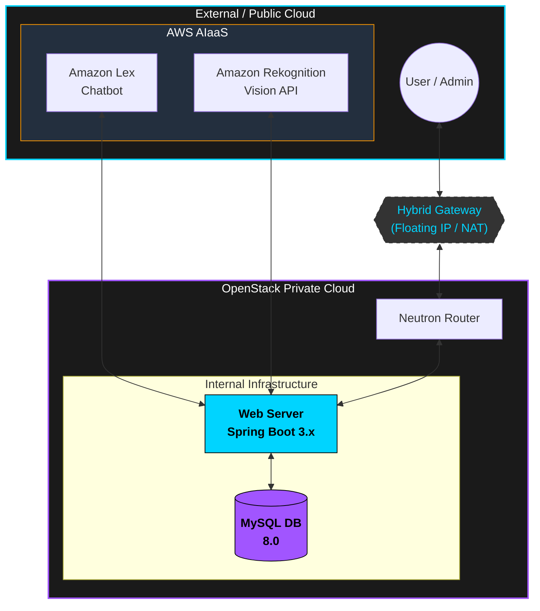
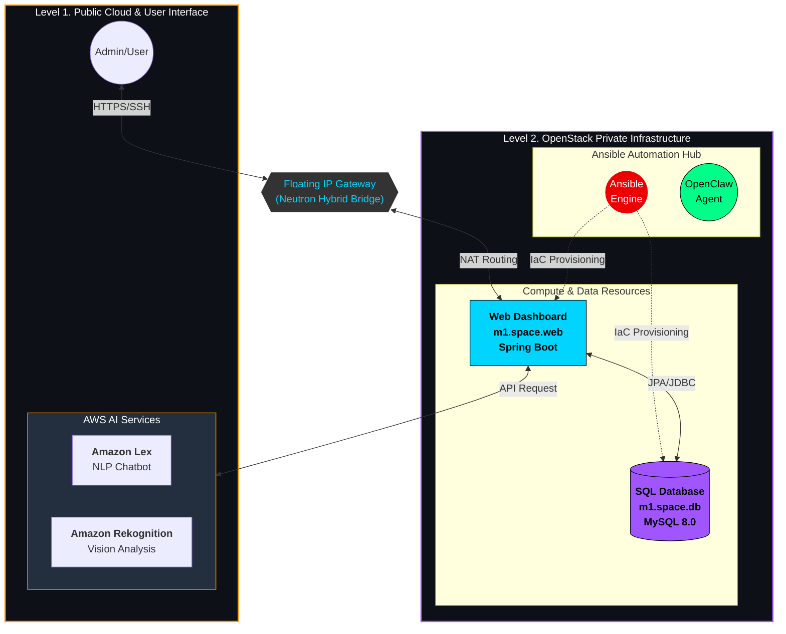

# 🚀 OpenStack-Based Hybrid AIaaS Dashboard

> **오픈스택 프라이빗 클라우드와 퍼블릭 AI 서비스를 통합한 개인 인프라 관리 대시보드**

  


## 📌 1. Project Overview (프로젝트 개요)
본 프로젝트는 **OpenStack**을 활용하여 직접 구축한 프라이빗 클라우드 환경 위에, 외부 **AI API(AIaaS)**를 연동한 대시보드형 홈페이지를 구축하는 것을 목표로 합니다. 
단순한 웹 서비스를 넘어, 인프라의 자동화 배포와 하이브리드 클라우드 전략을 실무적으로 구현하였습니다.

* **주요 기능:**
    * **Space One (Infra Monitor):** OpenStack 인스턴스 자원 및 네트워크 상태 실시간 확인
    * **Space Two (AI Playground):** AWS Lex 및 Rekognition 기반의 지능형 서비스 테스트 베드
    * **Space Three (Cloud Management):** Ansible 및 OpenClaw를 이용한 인프라 자동화 관리


---


## 🏗️ 2. System Architecture (시스템 아키텍처)
이 프로젝트는 **Neutron 외부망 연동**을 통해 로컬 자원과 퍼블릭 클라우드를 유기적으로 연결하는 '하이브리드 구조'를 가집니다.


<br><br><br>

<p align="center" style="font-size: 20px; font-weight: bold;">
  상세한 인프라 자원 및 자동화 흐름은 아래 상세 아키텍처를 참고해 주세요.
</p>

<br><br>



---


## 🏗️ 3. Infrastructure Detailed Design (인프라 상세 설계)

성능 최적화와 보안 강화를 위해 서비스 용도에 따라 인스턴스 자원을 분리하고, 논리적인 네트워크 격리 설계를 적용했습니다.

### 🖥️ 3.1 Instance Flavors (컴퓨트 자원)
| Flavor Name | vCPU | RAM | Disk | Primary Usage |
| :--- | :---: | :---: | :---: | :--- |
| **m1.space.web** | 2 | 4GB | 40GB | Spring Boot Web App & API Communication |
| **m1.space.db** | 1 | 2GB | 20GB | MySQL 8.0 Database (Isloated) |

### 🌐 3.2 Network & Subnet (네트워크 구성)
| Category | Name | Description |
| :--- | :--- | :--- |
| **External Net** | `ext-net` | 외부 사용자 접속 및 AWS AIaaS 연동을 위한 공인 IP 대역 |
| **Internal Net** | `space-int-net` | 인스턴스 간 보안 통신을 위한 독립된 프라이빗 네트워크 |
| **Subnet** | `space-subnet` | 내부 IP 자원 할당 (CIDR: `192.168.10.0/24`) |


---


## 🛡️ 4. Security Design (보안 설계)

시스템 안정성을 위해 서비스별 보안 그룹(Security Group)을 분리하여 적용했습니다.

| 대상 서버 | 보안 그룹명 | 개방 포트 | 허용 프로토콜 / 용도 |
| :--- | :--- | :--- | :--- |
| **WEB Server** | `sg-space-web` | **8080**, **22** | **HTTP**, **SSH** 접속 허용 |
| **DB Server** | `sg-space-db` | **3306**, **22** | **MySQL** (Web 대역만 허용), **SSH** |


---


## 🛠️ 5. Tech Stack (기술 스택)

### **Infrastructure & DevOps**
* **Cloud Platform:** OpenStack (Yoga/Zena version)
    * **Compute:** Nova (Instance Management)
    * **Network:** Neutron (L3 Router, Floating IP, Security Groups)
    * **Storage:** Cinder (Block Storage for DB)
* **Automation & Agents:** * **Ansible:** Infrastructure Provisioning & Configuration
    * **OpenClaw:** AI-driven Infrastructure Monitoring & Agentic Workflow
* **Dev Environment:** WSL2, Ubuntu 22.04 LTS, STS4 (Spring Tool Suite)

### **Backend & AIaaS**
* **Framework:** Java Spring Boot 3.x / Jakarta EE
* **Database:** MySQL 8.0 (Indexing & Query Optimization applied)
* **AI API (AIaaS):** * **Amazon Lex:** Natural Language Understanding for Command Processing
    * **Amazon Rekognition:** Image Analysis & User Context Recognition


---


## 📝 6. Key Implementation (핵심 구현 내용)

### **1) OpenStack 외부망 연동 (Neutron Gateway)**
* 프로젝트의 핵심 전제인 **외부망 연결 가능 상태**를 구현하기 위해 Neutron Router에 External Gateway를 설정하였습니다.
* **Floating IP**를 Web Server 인스턴스에 매핑하여 외부 유저의 접속 및 외부 AI API(AWS)와의 양방향 통신을 보장합니다.

### **2) 가볍고 강력한 대시보드 UI (Frontend)**
* 오빠(goonggeum)만의 감각적인 디자인을 유지하며, `Projects` 섹션을 확장하여 실시간 서버 자원(CPU, Mem) 상태를 시각화하였습니다.
* **Responsive Design:** 다양한 디바이스에서 인프라 상태를 확인할 수 있도록 최적화되었습니다.

### **3) AI-Driven Infrastructure (OpenClaw & AIaaS)**
* **OpenClaw**를 활용하여 인프라 장애 발생 시 AI가 원인을 분석하고 가이드를 제공하는 기능을 실험적으로 구현하였습니다.
* **AWS Lex**를 통해 텍스트 명령어로 인스턴스 정보를 조회하는 기능을 연동하였습니다.

  
---


## 🚀 7. How to Run (실행 방법)

### **Step 1: OpenStack Environment Setup**
1. **Neutron 네트워크 설정:** 외부 통신을 위해 External Gateway가 설정된 Router를 생성하고, 인스턴스에 Floating IP를 할당합니다.
2. **보안 그룹 설정:** 웹 접속을 위한 `8080`, 외부 AI API 연동을 위한 `443`, 관리를 위한 `22` 포트를 개방합니다.

### **Step 2: Infrastructure Provisioning (Ansible)**
1. `ansible-playbook setup.yml` 명령어를 통해 타겟 인스턴스에 Java, MySQL 및 필요한 환경 설정을 자동으로 수행합니다.

### **Step 3: Application Build & Run**
1. Spring Boot 애플리케이션 빌드 및 실행:
   ```bash
   ./gradlew clean bootRun


---


## 👨‍💻 Author
* **Name:** goonggeum (Oppa!)
* **Role:** Full-Stack & Cloud Infrastructure Developer
* **Contact:** [goonggeum@ajeossi.com](mailto:goonggeum@ajeossi.com)
* **GitHub:** [21ckortiger-star/space](https://github.com/21ckortiger-star/space)

---
© 2026 **kortiger**. All rights reserved. 모든 프로젝트 결과물은 교육용 포트폴리오 목적으로 제작되었습니다.

